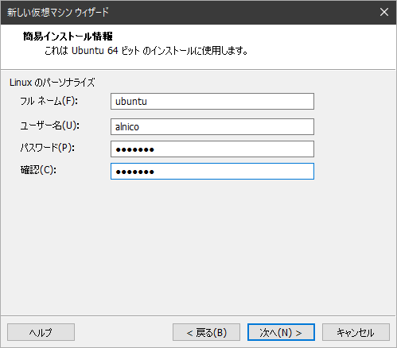
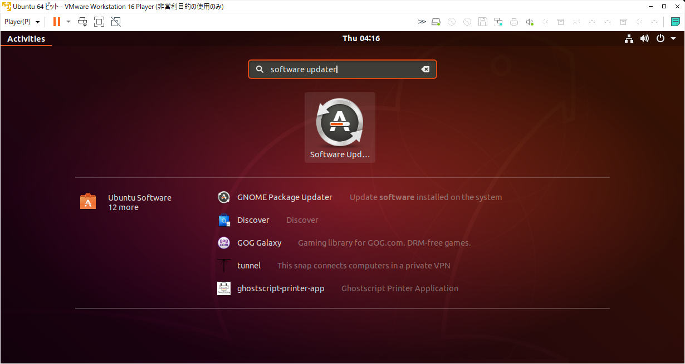
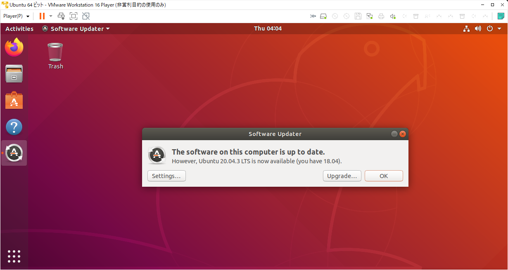
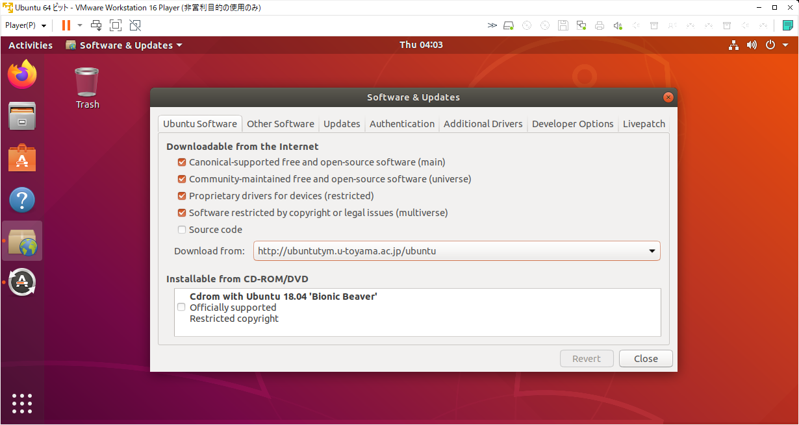
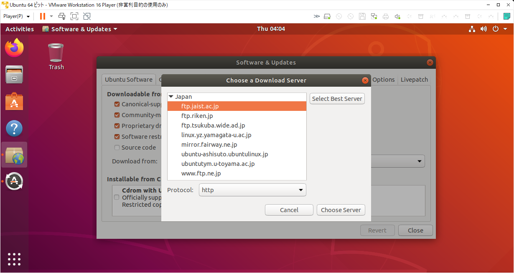

## VMware Workstation Player を用いて Windows マシン上に Ubuntu 18 仮想マシンを構築する

!!! info "環境"
    - Windows10

上記の環境に VMware Workstation Player を用いて Ubuntu 仮想マシンを構築する方法を説明します．各ソフトウェアのバージョンは次のとおりです．

- VMware Workstation Player 16.2.1
- Ubuntu Desktop 18.04.6 LTS

### VMware Workstation Player のインストール

ROS の開発環境としては Ubuntu を利用することが最も一般的です．ROS の開発用に Ubuntu がネイティブで動作している x86 アーキテクチャの PC が既にある場合はそれを利用すればいいのですが，普段は専ら Windows 環境で作業をしているという人もいるでしょう．そういう場合には Windows 環境上に他の OS を仮想的に動作させることを目的としたソフトウェアを利用することで手軽に Ubuntu 環境を手に入れることが出来ます．このようなソフトウェアで最も代表的なものが VMware Workstation Player です．非商用の場合は無償で利用することが出来ます．

[ここ](https://www.vmware.com/jp/products/workstation-player.html)からインストーラをダウンロードして Windows の慣習にならって普通にインストールします．途中で複数回の再起動を求められますが指示通り進めて下さい．

### Ubuntu イメージファイルの入手

[ここ](https://releases.ubuntu.com/18.04/)から Ubuntu のイメージファイルをダウンロードします．

### Ubuntu 仮想マシンの作成

入力を要するのは Fig.1 に示したスクショくらいです．フルネームとユーザー名を決める必要があります．フルネームはコンピュータの名前つもりで，ユーザー名はあなたのアカウント名のつもりで決めると良いでしょう．あとは進めていくと勝手に終わります．

<figure markdown>
  
  <figcaption>Fig. 1</figcaption>
</figure>

### Ubuntu のアップデート

インストールイメージファイルが作成された後も Ubuntu とそこに含まれるソフトウェア群は継続的に開発が進められているため，これらを最新の状態にする必要があります．初回起動時には自動的に起動しますが，「Software Updater」というアプリを起動して下さい．Fig. 2 のようにアプリケーション一覧画面の検索窓に Software Updater と打ち込むと見つかるはずです．

<figure markdown>
  
  <figcaption>Fig. 2</figcaption>
</figure>

Software Updater が起動するとソフトウェアのアップデートを勧められるので，Ubuntu 20 にはしないように気をつけつつ，指示通りすすめます．最終的に Fig. 3 に示したようなダイアログが表示されるので「Settings...」ボタンをクリックして設定の確認をしていきます．

<figure markdown>
  
  <figcaption>Fig. 3</figcaption>
</figure>

Fig. 4 に示したように利用するリポジトリの種類について，以下の4つにチェックマークが入っていることを確認して下さい．

- main
- restricted
- universe
- multiverse

<figure markdown>
  
  <figcaption>Fig. 4</figcaption>
</figure>

Fig. 5 に示したようにダウンロードサーバを適当なミラーサーバーから選びます．「Select Best Server」ボタンを押して自動で良さげなところを探してもらっても良いでしょう．

<figure markdown>
  
  <figcaption>Fig. 5</figcaption>
</figure>

最終的に Fig. 3 のようにアップデートが完了していることを確認して「OK」を押します．これで Ubuntu 環境のセットアップは完了です．
