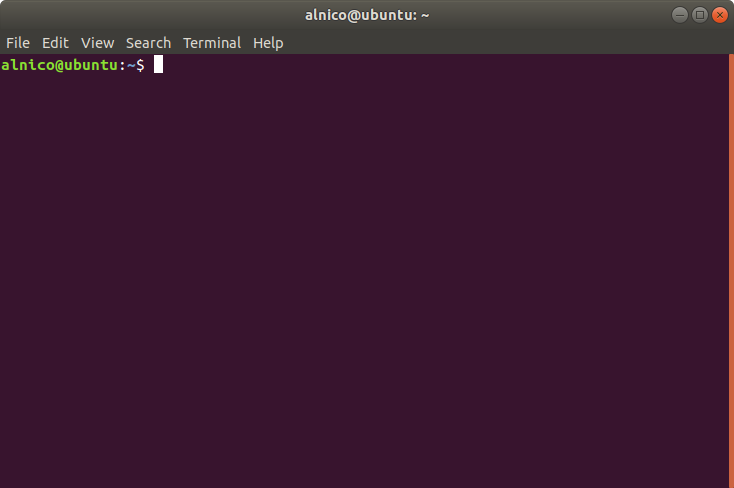

## ターミナルソフトとシェル

GUI 環境の Ubuntu にログインした後，デフォルトでインストールされている「Terminal」という名前のアプリケーションを利用して作業を始めると思います．Mac OS であれば「iTerm」というターミナルソフトがインストールされています．これはターミナルソフトと呼ばれるものです．シェルとは違います．

<figure markdown>
  
  <figcaption>Fig. 1 アプリケーション「Terminal」の見た目</figcaption>
</figure>

このターミナルソフトで様々なコマンド打ち込むことでシェルに対して命令を出すことができます．シェルはこの命令を解釈してカーネルに伝達することで実際の処理が行われます．つまり，シェルは画面上に見えているものを指すわけではなく，その画面を通して動作しているプログラムということになります．

ターミナルソフトにおいて CUI ベースの操作体系をとるこのようなシェルを特にコマンドラインシェルと呼びます．

## コマンドラインシェルの概要

シェルはターミナルソフト上で見えているものではなく，プログラムです．ただ1つだけ起動するという訳ではなく，複数起動することもあります．呼び出されれば起動し，処理が終われば終了します．あくまでもプログラムのひとつなので，その他の一般的なプログラムの挙動と同じ概念で考えることができます．

ただ，シェルがどのような条件で起動したのかによって呼び分けます．その理由は起動のタイミングによって，シェルが起動した直後に実行される初期化処理に違いがあるからです．この違いにより既に定義されている変数の値に違いが発生するのです．

コマンドラインシェルにも様々なものがありますが，ここでは基本的に bash を念頭において話を進めます．

### ログインシェルと非ログインシェル

コンピュータのあるユーザに対してログインしたその時に起動されるシェルはログインシェルと呼ばれます．例えば SSH 接続を利用してリモートマシンにログインした時です．

### 対話的シェルと非対話的シェル

対話的シェルの例

- コマンド入力を待っている bash
- `-i` オプション付きで実行される bash

非対話的シェルの例

- `-c` オプション付きで実行される bash

### カレントシェルとサブシェル

シェルはプログラムの一種なので，シェルが起動した時，その実行中のプログラムは OS からはひとつのプロセスとして認識されます．起動しているプロセスは `pstree` というコマンドで確認できます．その結果を以下に示します．

```
systemd─┬─ModemManager───2*[{ModemManager}]
        ├─NetworkManager─┬─dhclient
        │                └─2*[{NetworkManager}]
        ├─VGAuthService
        ├─accounts-daemon───2*[{accounts-daemon}]
        ├─acpid
        ├─avahi-daemon───avahi-daemon
        ├─bluetoothd
        ├─boltd───2*[{boltd}]
        ├─colord───2*[{colord}]
        ├─cron
        ├─cups-browsed───2*[{cups-browsed}]
        ├─cupsd
        ├─dbus-daemon
     （省略）
        ├─systemd─┬─(sd-pam)
        │         ├─at-spi-bus-laun─┬─dbus-daemon
        │         │                 └─3*[{at-spi-bus-laun}]
        │         ├─at-spi2-registr───2*[{at-spi2-registr}]
        │         ├─dbus-daemon
        │         ├─dconf-service───2*[{dconf-service}]
        │         ├─evolution-addre─┬─evolution-addre───5*[{evolution-addre}]
        │         │                 └─4*[{evolution-addre}]
        │         ├─evolution-calen─┬─evolution-calen───8*[{evolution-calen}]
        │         │                 └─4*[{evolution-calen}]
        │         ├─evolution-sourc───3*[{evolution-sourc}]
        │         ├─gnome-shell-cal───5*[{gnome-shell-cal}]
        │         ├─gnome-terminal-─┬─bash───pstree
        │         │                 └─3*[{gnome-terminal-}]
        │         ├─goa-daemon───3*[{goa-daemon}]
        │         ├─goa-identity-se───3*[{goa-identity-se}]
        │         ├─gvfs-afc-volume───3*[{gvfs-afc-volume}]
        │         ├─gvfs-goa-volume───2*[{gvfs-goa-volume}]
        │         ├─gvfs-gphoto2-vo───2*[{gvfs-gphoto2-vo}]
        │         ├─gvfs-mtp-volume───2*[{gvfs-mtp-volume}]
        │         ├─gvfs-udisks2-vo───2*[{gvfs-udisks2-vo}]
        │         ├─gvfsd─┬─gvfsd-trash───2*[{gvfsd-trash}]
        │         │       └─2*[{gvfsd}]
        │         ├─gvfsd-fuse───5*[{gvfsd-fuse}]
        │         ├─gvfsd-metadata───2*[{gvfsd-metadata}]
        │         ├─ibus-portal───2*[{ibus-portal}]
        │         ├─nautilus───3*[{nautilus}]
        │         └─xdg-permission-───2*[{xdg-permission-}]
     （省略）
```

全てを記載すると長いので途中で省略した箇所がありますが，`systemd` → `systemd` → `gnome-terminal-` → `bash` → `pstree` という経路が確認できます．矢印の左側のプロセスが矢印の右側のプロセスを呼び出していると解釈してください．

ここで次のようなコマンドを入力してみます．

``` bash
pstree -p -s -U $$ | { cat; pstree -p -s -U $$; }
```

```
systemd(1)───systemd(1597)───gnome-terminal-(21431)───bash(21441)─┬─bash(28077)───cat(28078)
                                                                  └─pstree(28076)
systemd(1)───systemd(1597)───gnome-terminal-(21431)───bash(21441)───bash(28077)───pstree(28079)
```


### シェル変数と環境変数

シェルにおける変数は「シェル変数」と「環境変数」の2種類に分けられます．どちらの変数もスコープは自身のプロセス内のみです．シェル変数はそのプロセス外へと影響を及ぼすことはありませんが，環境変数は子プロセス（サブシェル）へと継承されます．これは自身のプロセスが新しい子プロセス（サブシェル）を呼び出した時に，その初期化処理として，自身の環境変数と同じものがサブシェルの環境変数として新たに定義されることを意味します．参照ではないため子プロセス内で環境変数を変更した場合でも，親プロセスの環境変数の値は変更されません．

シェル変数と環境変数は慣例として全て大文字を用いて命名します．

通常の変数定義の書式ではシェル変数として変数を定義することができます．これを `export` コマンド用いて環境変数へと格上げしたり，逆にシェル変数へと格下げすることができます．


### シェルの初期化処理

|  | ログイン | 非ログイン |
| --- | --- | --- |
| 対話的 | `~/.bash_profile`<br>`~/.bash_login`<br>`~/.profile` | `~/.bashrc` |
| 非対話的 | `~/.bash_profile`<br>`~/.bash_login`<br>`~/.profile` | `$BASH_ENV` |


`~/.bash_profile`

`~/.profile`

`~/.bashrc`


## 色々あるコマンドラインシェル

### Bourne Shell (sh)

### Bourne Again Shell (bash)